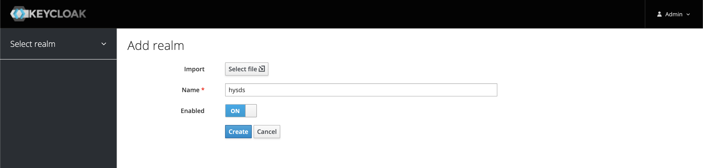

## Sample React app w/ OpenID Connect

<b>[OpenID Connect](https://openid.net/connect/) ...</b>

> ... is a simple identity layer on top of the OAuth 2.0 protocol. It allows Clients to verify the identity of the End-User based on the authentication performed by an Authorization Server, as well as to obtain basic profile information about the End-User in an interoperable and REST-like manner

Examples of OpenID connect providers:

- [AWS Cognito](https://aws.amazon.com/cognito/)
- [Azure Active Directory](https://docs.microsoft.com/en-us/azure/active-directory/fundamentals/auth-oidc)
- [Okta](https://www.okta.com/)
- [Keycloak](https://www.keycloak.org/downloads)
- [Gluu](https://gluu.org/)
- [Hydra](https://www.ory.sh/hydra/)

For the sake of this demo we will be using Keycloak because ease of deployment and it's open sourced

### Requirements

- [nodejs](https://nodejs.org/en/)
- [docker (optional)](https://www.docker.com/)
- [Keycloak (if not using docker)](https://www.keycloak.org/)

##### Start the Keycloak server (http://localhost:8080) options:

- Run Keycloak in docker:

```bash
$ docker run \
  -e KEYCLOAK_USER=admin \
  -e KEYCLOAK_PASSWORD=password \
  -p 8080:8080 \
  jboss/keycloak:16.1.1
```

- Download [keycloak](https://www.keycloak.org/downloads) and run it

```bash
# >= v15.1.0
$ ./bin/kc.sh start-dev

# < v15.1.0
$ ./bin/standalone.sh
```

<b>Crete the Keycloak realm</b>



<b>Create the OpenID client</b>
name it `test-oidc-client` with Root URL: `http://localhost:3000`


<b>Create realm user</b>


<b>Set the user credentials</b>


### Running the React Application

JavaScript Packages used:

- [oidc-client-ts](https://authts.github.io/oidc-client-ts/) is used handle login/authentication
  - Supports both OpenID Connect and [OAuth 2.0](https://oauth.net/2/)
  - [oidc-client-ts](https://authts.github.io/oidc-client-ts/) is the successor to the now deprecated [oidc-client-js](https://github.com/IdentityModel/oidc-client-js) package
- [Redux](https://react-redux.js.org/) is used as the state management tool to access the user object and `access_token` between pages
- [React router](https://reactrouter.com/) is used for client-side routing

Copy the `src/settings.template.js` file to `src/settings.js`

```js
// settings.template.js
export const AUTHORITY = "http://localhost:8080/auth/realms/<realm>";
export const CLIENT_ID = "<client_id>";
export const AUTO_RENEW_TOKEN = false;
export const HOME_PAGE = "http://localhost:3000/";

// settings.js
export const AUTHORITY = "http://localhost:8080/auth/realms/hysds";
export const CLIENT_ID = "test-oidc-client";
export const AUTO_RENEW_TOKEN = false;
export const HOME_PAGE = "http://localhost:3000/";
```

install node modules and start the `webpack` server

```bash
$ npm install
$ npm start
```

If you access the application at `http://localhost:3000` you will be redirected to Keycloak's login page
Type in the username and password and you will be redirected to the app


Home page has the decoded `access_token` (claims) where the user's metadata & role information can be accessed

